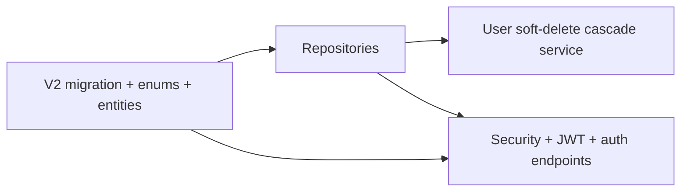

<!-- 175675e8-f9d0-4aa1-9733-19f5a0dea700 -->
---
todos:
  - id: "flyway-v2-entities"
    content: "Add V2 Flyway migration (users, decks, cards) + JPA entities/enums + audit/soft-delete fields"
    status: pending
  - id: "repos-cascade"
    content: "Add Spring Data repositories + transactional user soft-delete cascade for decks/cards"
    status: pending
  - id: "jwt-deps-security"
    content: "Add Spring Security + JWT dependencies and SecurityFilterChain (public auth, protected API)"
    status: pending
  - id: "auth-flows"
    content: "Implement register/login/logout, BCrypt, email normalization, soft-deleted reactivation + JWT issuance/validation"
    status: pending
  - id: "mockito-unit-tests"
    content: "Add Mockito unit tests (@ExtendWith(MockitoExtension), @Mock/@InjectMocks) for services (auth, email/reactivation, user soft-delete cascade)"
    status: pending
isProject: false
---
# Steps 1–2: Domain layer + JWT authentication

## Current state

- [`pom.xml`](pom.xml): Web, Validation, JPA, Flyway, PostgreSQL; **no** Spring Security / JWT yet.
- [`V1__baseline.sql`](src/main/resources/db/migration/V1__baseline.sql): no-op baseline (`SELECT 1`).
- [`application-test.properties`](src/test/resources/application-test.properties): H2 in PostgreSQL mode, `ddl-auto=create-drop`, **Flyway disabled** — tests will rely on Hibernate creating schema unless you add test Flyway later.
- No domain packages under `com.cardly` except [`CardlyBackendApplication`](src/main/java/com/cardly/CardlyBackendApplication.java).

## Step 1 — Domain layer

### Schema (new Flyway migration)

Add **`V2__init_schema.sql`** (keep V1 as baseline) defining:

| Table | Notes |
|--------|--------|
| `users` | `id` **SERIAL** (maps to `serial4` per spec), `name`, `email` **UNIQUE**, `password`, `role` (e.g. `VARCHAR` + `CHECK` or PostgreSQL `ENUM`), `created_at`, `updated_at`, `deleted_at` |
| `decks` | FK `user_id` → `users(id)`, `name`, `position` (integer sort order), `subject`, audit columns |
| `cards` | FK `deck_id` → `decks(id)`, `question`, `answer`, `difficulty_level`, `due_at` (timestamptz, nullable for “never scheduled”), `right_streak`, `wrong_streak`, `scheduled_interval` (stable string: enum **names** for **1, 2, 3, 5, 7, 9** days per [`card-difficulty-level-rules.md`](docs/agents/card-difficulty-level-rules.md)), audit columns |

Indexes: at minimum **unique `email`**, FK indexes on `decks.user_id` and `cards.deck_id`.

Scheduling rules logic belongs in a **later** service layer; Step 1 only **persists** the fields listed in `todo.md`.

### Naming: Java enums

- **Every** Java `enum` type name must end with **`ENUM`** in capitals (e.g. `UserRoleENUM`, `DifficultyLevelENUM`, `ScheduledIntervalENUM`). Enum **constants** keep normal Java style (e.g. `USER`, `SUPERADMIN`).

### JPA model

- Package suggestion: `com.cardly.domain` (entities + enums) and `com.cardly.repository`.
- **Enums:** `UserRoleENUM` (`USER`, `SUPERADMIN`); card `DifficultyLevelENUM` (`NONE`, `EASY`, `MEDIUM`, `HARD`); `ScheduledIntervalENUM` with the seven allowed day-buckets only.
- **Audit + soft delete:** every entity has `createdAt`, `updatedAt`, `deletedAt` (`Instant`/`OffsetDateTime` + UTC, aligned with `hibernate.jdbc.time_zone=UTC`). Use `@PrePersist`/`@PreUpdate` or Spring Data JPA auditing — match one style project-wide.
- **Associations:** `User` 1—* `Deck` 1—* `Card`; standard `@ManyToOne` / `@OneToMany(mappedBy=..., fetch=LAZY)`.
- **User soft-delete cascade:** JPA `@SQLDelete` alone does not cascade soft-delete to children. Implement a **transactional service method** (e.g. `UserService.softDeleteUser`) that sets `deletedAt` on the user and **all** their decks and cards in **one** `@Transactional` boundary. Repositories or queries must consistently **exclude** rows with `deletedAt != null` for normal operations (custom `@Query` or explicit predicates), while still allowing **lookup by normalized email** for auth/reactivation (including soft-deleted rows when needed).

### Repositories

- `UserRepository`, `DeckRepository`, `CardRepository` extending `JpaRepository`.
- `UserRepository`: method to find by **normalized email** for login/register/reactivation (see Step 2).

---

## Step 2 — JWT authentication

### Dependencies

Add to [`pom.xml`](pom.xml):

- `spring-boot-starter-security`
- JWT library compatible with Spring Boot 3 / Jakarta (e.g. **JJWT** 0.12.x: `jjwt-api`, `jjwt-impl`, `jjwt-jackson` with `runtime` where appropriate)

### Security configuration

- **Stateless** session; **JWT** in `Authorization: Bearer <token>` (or agreed header).
- **Public:** `POST` register, `POST` login (paths under e.g. `/api/auth/...`).
- **Authenticated:** other API routes as you define (minimal stub is fine for this step).
- **Passwords:** `BCryptPasswordEncoder` (strength per Spring defaults unless you standardize).
- **Logout:** Implement `POST /api/auth/logout` as **idempotent** success; with pure stateless JWT, **document** that invalidation is **client-side discard** + prefer **short access-token TTL** to limit exposure. Avoid adding Redis unless you explicitly want a blocklist later.

### Email normalization and uniqueness

- **Single helper** used on all write paths: trim, lowercase, optional Unicode normalization if you choose (document the exact rule).
- **Unique email including soft-deleted rows:** enforced by DB unique index on `email` (store **normalized** form only).
- **Reactivation:** On register, if a row exists with that email and `deletedAt != null`, **do not** insert a new row: verify **password**, then **clear `deletedAt`**, update name/password/role/timestamps as needed, and issue JWT — matching `todo.md` §User reactivation.

### API surface (minimal)

- DTOs for register/login requests and auth responses (token + expiry metadata if useful).
- Map validation errors with `@ControllerAdvice` if not already present (optional but typical).

### Tests

- **Unit tests with Mockito** (preferred for business logic): `@ExtendWith(MockitoExtension.class)`, `@Mock` dependencies, `@InjectMocks` for the class under test. Cover **auth** flows (register, login, reactivation, JWT-related collaborators mocked), **email normalization**, and **user soft-delete cascade** (repositories mocked). No Spring context required for these pure unit tests.
- **Optional later:** slice tests (`@WebMvcTest` + `@MockBean`) or `@SpringBootTest` with the `test` profile + H2 if you add integration coverage; keep H2 compatibility in mind (`application-test.properties`).
- `mockito-core` is already pulled transitively via `spring-boot-starter-test`; use it explicitly in unit test classes as above.

---

## Order of work

1. Flyway V2 + entities + repos + cascade soft-delete service.  
2. Security + JWT + register/login/logout + email/reactivation rules.

## Files likely touched (non-exhaustive)

- New: `src/main/resources/db/migration/V2__init_schema.sql`
- New: `com.cardly.domain.*`, `com.cardly.repository.*`, `com.cardly.service` (cascade + auth)
- New: `com.cardly.config.SecurityConfig`, JWT filter/provider, `com.cardly.api` or `...web` controllers
- New: `src/test/java/...` Mockito unit tests for services (naming aligned with classes under test, e.g. `*Test.java`)
- Update: [`pom.xml`](pom.xml), optionally [`application.properties`](src/main/resources/application.properties) for JWT secret/TTL

No changes to `docs/agents/` (local-only per project rules).
