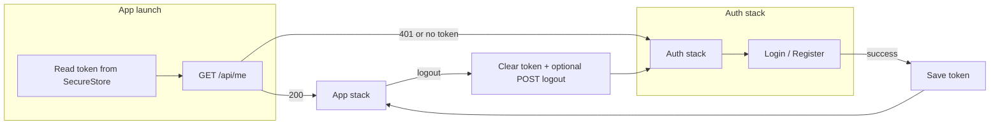

<!-- 880d1311-9689-4b86-9a73-090681d540f2 -->
---
todos:
  - id: "gitignore-cursor"
    content: "Add `.cursor/` to cardly-rnative-app `.gitignore`"
    status: pending
  - id: "cursor-rules-sync"
    content: "Align mobile `read-already-done.mdc`; add backend `cardly-rnative-app.mdc` (Language + Code/commits)"
    status: pending
  - id: "step1-api"
    content: "Add configurable API base URL (env/extra), fetch wrapper + Bearer, TS DTO types"
    status: pending
  - id: "step2-session"
    content: "expo-secure-store JWT persistence, bootstrap /api/me, logout + backend contract check"
    status: pending
  - id: "step3-nav-ui"
    content: "React Navigation stacks, Login/Register/Home placeholder, validation wiring"
    status: pending
  - id: "step4-reactivation"
    content: "Inspect cardly-backend; implement reactivation UX or defer with clear errors"
    status: pending
  - id: "docs-local"
    content: "Update docs/agents/already-done.md (packages, EXPO_PUBLIC_*, Android 10.0.2.2 note)"
    status: pending
isProject: false
---
# Plan from `docs/agents/todo.md`

## Repo hygiene and Cursor rules (run early)

- **Gitignore (mobile repo):** Add `.cursor/` to [`C:/projects/cardly/cardly-rnative-app/.gitignore`](.gitignore) so local Cursor metadata (e.g. plans) is not committed. Use a line such as `.cursor/` at an appropriate place (e.g. after `docs/agents/` or in a small “Editor” block).
- **Mobile rule parity:** Update [`C:/projects/cardly/cardly-rnative-app/.cursor/rules/read-already-done.mdc`](.cursor/rules/read-already-done.mdc): replace the single inline sentence about English/pt-BR with an explicit **`## Language and locale`** section matching the backend policy (see below). Keep or merge the existing **`## Code and commits`** block so it matches backend wording for shared stacks: no comments in TS/JS; no emojis in commit messages or PR titles. Omit Java-only bullets (e.g. IntelliJ class `}` rule) from the mobile file.
- **Backend “frontend” rule:** In [`C:/projects/cardly/cardly-backend/.cursor/rules/`](C:/projects/cardly/cardly-backend/.cursor/rules/), add a dedicated rule file for the Expo client, e.g. **`cardly-rnative-app.mdc`**, with frontmatter `alwaysApply: true` (or `false` + clear `description` if you prefer it only when @-mentioned). Body should include:
  - **`## Language and locale`** — same as [`cardly-backend/.cursor/rules/read-already-done.mdc`](C:/projects/cardly/cardly-backend/.cursor/rules/read-already-done.mdc) (pt-BR for `docs/agents/`, academic/report-facing material, user-facing docs where applicable; en-US for source identifiers, commit messages, Cursor rules, agent instructions). Optionally one line pointing to the sibling repo path `C:/projects/cardly/cardly-rnative-app`.
  - **`## Code and commits`** — TypeScript/React Native subset: no comments in source; no emojis in commits/PR titles. Do not duplicate Java formatting rules here.
- **Note:** Backend [`read-already-done.mdc`](C:/projects/cardly/cardly-backend/.cursor/rules/read-already-done.mdc) already contains Language and locale + Code and commits for the **Spring** project; the new file avoids overloading that file and gives agents an explicit “mobile client” anchor.

## Current state

- [`App.tsx`](App.tsx) is a single splash-style screen (fonts, logo, tagline). No HTTP client, auth, or navigation.
- [`package.json`](package.json) has no `@react-navigation/*`, `expo-secure-store`, or `.env` tooling.
- [`app.json`](app.json) has no `extra` block for API URL yet.

## Step 1 — API layer and configuration

- **Base URL:** Add `EXPO_PUBLIC_API_BASE_URL` (Expo convention for public env at build time) and/or `expo.extra` via [`app.config.ts`](app.config.ts) (or keep [`app.json`](app.json) `extra` if you prefer static JSON). Document the **Android emulator** rule from `todo.md`: use `http://10.0.2.2:<port>` (or LAN IP for a physical device), not `localhost`.
- **Env example:** Add a **tracked** root `.env.example` listing `EXPO_PUBLIC_API_BASE_URL=` (actual `.env` stays local / gitignored if you adopt it).
- **HTTP client:** Small module under e.g. `src/api/` using `fetch` with a helper that prefixes the base URL, sets `Content-Type: application/json`, and attaches `Authorization: Bearer <token>` when a token is provided.
- **Types:** TypeScript interfaces matching backend DTOs: register `{ name, email, password }`, login `{ email, password }`, auth response `{ token, expiresAt }`, me `{ id, email, role }` (align names with Spring `MeResponse` when wiring).

## Step 2 — Session and token storage

- **Dependency:** `expo-secure-store` for the JWT (not `AsyncStorage` for the token).
- **Flow:** On launch, read token from secure store; if present, call `GET /api/me` with Bearer; on success hydrate session (`id`, `email`, `role`); on 401/expired, clear token and treat as logged out.
- **Logout:** Clear secure store + in-memory session; call `POST /api/auth/logout` with Bearer **if** the backend requires an authenticated logout (confirm against `cardly-backend` — adjust if the endpoint is absent or public).

## Step 3 — Navigation and auth UI

- **Dependencies:** `@react-navigation/native`, `@react-navigation/native-stack`, and required peers (`react-native-screens`, `react-native-gesture-handler` per Expo/React Navigation docs for SDK 54).
- **Structure:** Root navigator with an **auth stack** (Login, Register) vs **app stack** (minimal post-auth placeholder home + logout affordance), switched by session state from Step 2.
- **Screens:** Login and Register forms with validation (email shape, password length ≥ 8) before calling Step 1 API functions; success persists token (Step 2) and navigates to app stack; logout returns to auth stack.
- **Docs:** Update local [`docs/agents/already-done.md`](docs/agents/already-done.md) with new packages, env variable name, and chosen emulator base URL pattern (per project rule: that folder is local-only, not for Git).

## Step 4 — Account reactivation (conditional)

- **Discovery:** Read `cardly-backend` auth/register behavior and `docs/agents/todo.md` there (or OpenAPI/controller responses) for a **clear contract** (e.g. HTTP 409, dedicated endpoint, or structured error body).
- **If contract exists:** On Register, handle that case with a dedicated UX path (e.g. prompt + call reactivation API as specified by backend).
- **If not:** Keep single Register flow; surface backend error message without guessing; note “blocked on backend” in local agent docs.

## Explicitly out of scope (per `todo.md`)

- Deck list/CRUD, cards, study session, SRS — **blocked** until `cardly-backend` exposes deck/card REST and DTOs.

## Academic alignment (downstream, not in `todo.md` lines 1–49)

[`requisitos-academicos.md`](docs/agents/requisitos-academicos.md) requires multiple roles and a **Superadmin-only** UI. Once `GET /api/me` exposes `role`, a later increment can branch the app stack (e.g. separate navigator or screen group for `SUPERADMIN`) — **after** Steps 1–3 are stable.

