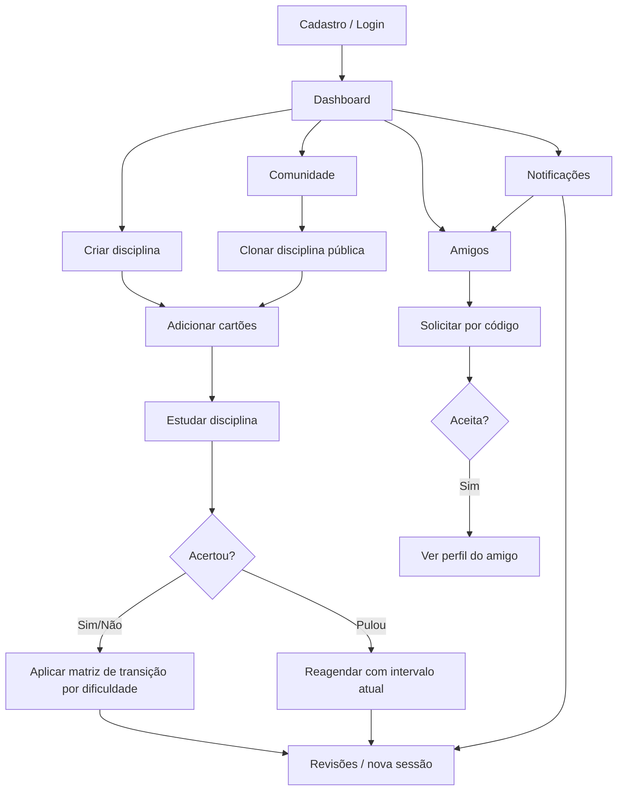

# Cardly — Regras de negócio

Documento de referência sobre **como o Cardly funciona hoje**, do ponto de vista de produto e regras de domínio. Destina-se a pessoas (time, stakeholders, revisores) — não é um manual técnico de implementação.

**Última atualização:** junho de 2026 (com base no código em produção, tag `v12`).

---

## O que é o Cardly

O Cardly é uma plataforma de **flashcards com repetição espaçada**. O usuário organiza conteúdo em **disciplinas** (decks), cadastra **cartões** (pergunta e resposta) e **estuda ou revisa** conforme o cartão fica disponível.

Além do estudo individual, o sistema oferece:

- **Comunidade** — compartilhar disciplinas públicas e clonar conteúdo de outros usuários
- **Rede de amigos** — solicitações de amizade por código público
- **Dashboard** — visão geral de progresso e métricas
- **Notificações** — avisos de revisão vencida e de amizades

---

## Conceitos principais

| Termo | Significado |
|-------|-------------|
| **Usuário** | Pessoa autenticada no sistema |
| **Disciplina (deck)** | Conjunto de cartões sobre um tema. Tem nome, matéria (`subject`) e ordem na lista do usuário |
| **Cartão (card)** | Par pergunta/resposta dentro de uma disciplina |
| **Estudo** | Sessão que inclui cartões **novos** (nunca respondidos) e cartões **vencidos** |
| **Revisão** | Sessão que inclui **somente** cartões já agendados e **vencidos** (não inclui cartões novos) |
| **Agendamento** | Data/hora (`dueAt`) em que o cartão volta a ficar disponível para revisão |
| **Código público** | Número de 6 dígitos que identifica o usuário na rede de amigos (ex.: `#124123`) |

---

## 1. Contas e acesso

### Cadastro e login

- É possível criar conta com **e-mail e senha** ou entrar com **Google**.
- O e-mail é normalizado (minúsculas, sem espaços extras) e deve ser **único** no sistema.
- A senha deve ter entre **8 e 128 caracteres**.
- O nome é obrigatório (até 255 caracteres).

**Login com e-mail:** credenciais inválidas retornam erro genérico, sem indicar se o e-mail existe.

**Login com Google:** exige e-mail verificado pelo Google. Se a conta já existir, ela é reativada; se não existir, uma nova conta é criada automaticamente.

### Sessão

- Após login, o usuário recebe um token de acesso com validade de **1 hora**.
- Rotas da API exigem autenticação, exceto cadastro, login e páginas de erro.

### Papéis

| Papel | O que pode fazer |
|-------|------------------|
| **USER** | Usar o app normalmente: disciplinas, cartões, estudo, comunidade, amigos |
| **SUPERADMIN** | Tudo acima, mais painel de administração para gerenciar usuários, disciplinas e cartões de qualquer pessoa |

### Código público

- Todo usuário ativo possui um **código numérico único** (sequência a partir de `100000`).
- Esse código é usado para **enviar solicitação de amizade** — não se usa e-mail interno nem ID técnico.
- No app, o código informado deve ter **exatamente 6 dígitos** (com ou sem `#` na frente).

### Perfil e exclusão de conta

- O usuário pode alterar **nome** e **senha** (senha nova também exige mínimo de 8 caracteres e confirmação da senha atual).
- **Excluir conta** faz uma exclusão lógica (*soft delete*): a conta deixa de funcionar, mas os dados permanecem no banco com marca de exclusão.
- Ao excluir a conta, **todas as disciplinas e cartões** do usuário também são marcados como excluídos.
- Se alguém se cadastrar de novo com o **mesmo e-mail** de uma conta excluída, a conta antiga é **reativada** (não se cria duplicata de e-mail).

---

## 2. Disciplinas

### Criação e edição

- Cada disciplina pertence a **um único usuário** (dono).
- Campos obrigatórios: **nome** e **matéria** (`subject`).
- Por padrão, a disciplina nasce **privada**.
- A ordem na lista é definida por um campo de **posição**; se não informada, a nova disciplina vai para o final.

### Privada vs pública

| Visibilidade | Comportamento |
|--------------|---------------|
| **Privada** | Só o dono vê e gerencia |
| **Pública** | Aparece na **Comunidade** para outros usuários |

O dono pode alternar entre privada e pública a qualquer momento.

### Exclusão

- Excluir uma disciplina remove também **todos os cartões** dela (exclusão lógica em cascata).

### Contadores exibidos por disciplina

Para cada disciplina, o sistema calcula:

| Contador | Significado |
|----------|-------------|
| **Total de cartões** | Quantidade de cartões ativos |
| **Agendados** | Cartões que já foram estudados ao menos uma vez (`dueAt` preenchido) |
| **Aguardando** | Agendados com data **futura** (ainda não venceram) |
| **Prontos para revisão** | Agendados com data **passada ou atual** (vencidos) |

Cartões **nunca estudados** entram no total, mas **não** entram em aguardando nem em prontos para revisão.

---

## 3. Cartões

### Estado inicial

Todo cartão novo começa assim:

- Pergunta e resposta preenchidas
- **Sem dificuldade** (`NONE`)
- **Sem data de revisão** (`dueAt` vazio)
- Sequências de acertos e erros em zero
- **Sem intervalo** agendado

### Edição

- Só é possível alterar **pergunta** e **resposta**.
- Editar o texto **não altera** agendamento, dificuldade nem histórico de estudo.

### Exclusão

- Exclusão lógica individual; o cartão deixa de aparecer nas listagens e sessões.

---

## 4. Estudo e repetição espaçada

Esta é a regra central do produto: **o que acontece quando o usuário responde, erra ou pula um cartão**, e **quando ele volta a aparecer**.

### Estados de um cartão (visão prática)

```
┌─────────────────┐     primeira resposta      ┌─────────────────┐
│  Nunca estudado │ ───────────────────────────► │    Agendado     │
│  (dueAt vazio)  │                              │  (dueAt futuro  │
└─────────────────┘                              │   ou passado)   │
         │                                       └────────┬────────┘
         │                                                │
         │  entra no ESTUDO                               │ quando dueAt ≤ agora
         │  (modo estudo)                                 ▼
         │                                       ┌─────────────────┐
         └──────────────────────────────────────►│    Vencido      │
                                                 │ (pronto p/ rev.)│
                                                 └─────────────────┘
```

| Estado | Condição | Aparece em… |
|--------|----------|-------------|
| **Nunca estudado** | Sem `dueAt` | Modo **estudo** |
| **Aguardando** | `dueAt` no futuro | Tela de revisões (com contagem regressiva) |
| **Vencido** | `dueAt` no passado ou agora | Modo **estudo** e modo **revisão** |

### Dois modos de sessão

| Modo | Quando usar | Quais cartões entram |
|------|-------------|----------------------|
| **Estudo** | Botão na disciplina; cartões novos + vencidos | Nunca estudados **ou** vencidos |
| **Revisão** | Aba Revisões → “Revisar” | **Somente** vencidos que já foram agendados |

**Importante:** cartões novos **não** entram na sessão de revisão dedicada. Eles só aparecem no modo estudo.

### Responder: acertou / errou (regra atual v12)

Quando o usuário responde:

- **Acertei**: `rightStreak += 1` e `wrongStreak = 0`
- **Errei**: `wrongStreak += 1` e `rightStreak = 0`
- Evento de estudo é registrado como **CORRECT** ou **WRONG**

O próximo nível e intervalo dependem do nível atual:

| Nível atual | Resposta | Próximo nível | Próximo intervalo |
|-------------|----------|---------------|-------------------|
| `NONE` | Acertei | `MEDIUM` | **4 horas** |
| `NONE` | Errei | `HARD` | **2 horas** |
| `MEDIUM` | Acertei | `EASY` | **36 horas** |
| `MEDIUM` | Errei | `HARD` | **2 horas** |
| `HARD` | Acertei | `MEDIUM` | **4 horas** |
| `HARD` | Errei | `HARD` | **2 horas** |
| `EASY` | Acertei | `EASY` | **36 horas** |
| `EASY` | Errei | `MEDIUM` | **4 horas** |

### Pular

Quando o usuário **pula** o cartão:

- Não exige virar o cartão (diferente de acertar/errar)
- Mantém dificuldade e intervalo atuais; se nunca estudado, usa **Difícil** + **1 dia**
- Reagenda a partir de **agora** com esse intervalo
- Evento registrado como **SKIPPED**
- **Não zera** as sequências de acerto/erro

### Papel do streak

Os streaks são mantidos para histórico e exibição na interface, mas **não escalam intervalo** por quantidade de acertos/erros consecutivos. O intervalo vem da matriz de transição por dificuldade.

### Experiência na sessão de estudo

1. Os cartões são carregados em fila (até **100 por sessão** no app).
2. Um cartão por vez, com animação de virar.
3. **Acertei / Errei** só ficam disponíveis **depois de virar** o cartão.
4. Ao terminar a fila, o app informa e pode sugerir ir para Revisões.

### Rótulo do botão na disciplina

- Se **nenhum** cartão da disciplina tem progresso → **“Iniciar estudo desta disciplina”**
- Se **pelo menos um** cartão já foi respondido, pulado ou agendado → **“Iniciar revisão desta disciplina”**

“Progresso” significa: dificuldade diferente de `NONE`, data de revisão preenchida, ou sequência de acerto/erro maior que zero.

---

## 5. Dashboard e métricas

### Cards principais

| Métrica | O que conta |
|---------|-------------|
| **Disciplinas** | Disciplinas ativas do usuário |
| **Cartões totais** | Todos os cartões ativos |
| **Disponíveis agora** | Cartões **vencidos** + cartões **nunca estudados** |
| **Respondidos hoje** | Qualquer interação na sessão hoje (acerto, erro ou pular), contando desde **00:00 UTC** |

### Gráfico de pizza (estado dos cartões)

| Fatia | Significado |
|-------|-------------|
| **Vencidos** | Agendados com data já passada |
| **Agendados** | Com data futura (aguardando) |
| **Sem agendamento** | Nunca estudados |

### Gráfico por matéria

- Agrupa disciplinas pelo campo **matéria** (`subject`)
- Matéria vazia aparece como **“Sem disciplina”**
- Soma totais, vencidos, aguardando e sem agendamento por grupo
- Ordena pelos grupos com mais cartões

### Calendário de estudo

- Marca os dias em que houve **pelo menos uma** ação de estudo (acerto, erro ou pular)
- Usa referência **UTC** para definir o “dia”
- O app consulta até **240 dias** de histórico no calendário

### Diferença importante entre métricas

| Onde | Cartões nunca estudados |
|------|-------------------------|
| **Disponíveis agora** (dashboard) | **Incluídos** |
| **Vencidos** (gráfico / revisão) | **Excluídos** |
| **Notificação de revisão vencida** | **Excluídos** |

Ou seja: o dashboard incentiva estudar cartões novos, mas o alerta de “revisão vencida” só considera cartões que **já tinham sido agendados** e passaram da data.

---

## 6. Comunidade

A Comunidade lista disciplinas **públicas de outros usuários**. O dono **não vê** as próprias disciplinas nessa listagem.

### Clonar disciplina

Qualquer usuário autenticado pode clonar uma disciplina pública de outra pessoa, desde que:

- **Não seja** o próprio dono
- **Ainda não tenha clonado** aquela disciplina antes (uma cópia por usuário por origem)

Ao clonar:

- A cópia é sempre **privada**
- Nome e matéria são copiados
- Todos os cartões são copiados (**pergunta e resposta**), mas **sem progresso** (como cartões novos)
- A cópia vai para o final da lista do usuário

Se já existir clone ativo, a interface mostra **“Abrir minha cópia”** em vez de clonar de novo.

Se o usuário **excluir a cópia** em Minhas Disciplinas, pode clonar a mesma disciplina novamente. A aba **Comunidade** recarrega a listagem ao retornar, exibindo **Clonar** em vez de manter o estado antigo.

**Observação:** clonar é diferente de criar manualmente duas disciplinas com o mesmo nome — o sistema só impede **duplicata de clone da mesma origem**, não nomes repetidos criados à mão.

---

## 7. Amigos

### Como adicionar

1. Usuário A informa o **código público de 6 dígitos** do usuário B
2. B recebe uma **solicitação pendente**
3. B pode **aceitar** ou **negar**
4. A pode **cancelar** enquanto estiver pendente

### Regras

| Regra | Detalhe |
|-------|---------|
| Auto-solicitação | Não é permitido enviar solicitação para si mesmo |
| Solicitação duplicada | Se já existe solicitação **pendente** entre A e B, novo envio é bloqueado |
| Reenvio após negar/cancelar | O registro anterior pode ser reutilizado; nova solicitação volta para **pendente** |
| Aceitar | Só quem **recebeu** pode aceitar, e só se estiver pendente |
| Negar | Só quem **recebeu**; status passa a **negada** (registro permanece) |
| Cancelar | Só quem **enviou**; status **cancelada** + exclusão lógica do registro |

### Lista de amigos

- Amizade **aceita** em qualquer direção conta
- Cada amigo aparece **uma vez**, ordenado por nome
- Contas excluídas não aparecem

### Perfil do amigo

- Só acessível se houver amizade **aceita**
- Mostra nome, e-mail, código público, totais (disciplinas, cartões, cartões vencidos) e lista de disciplinas com contadores
- **Somente leitura** — não é possível estudar os cartões do amigo

---

## 8. Notificações

### Tipos de aviso

| Tipo | Quando dispara | Para onde leva ao tocar |
|------|----------------|------------------------|
| **Revisão vencida** | Usuário tem cartões agendados vencidos | Aba **Revisões** |
| **Solicitação de amizade** | Alguém envia solicitação | Aba **Amigos** |
| **Solicitação aceita** | Amigo aceita sua solicitação | Aba **Amigos** |

### Revisão vencida (detalhes)

- Verificação automática a cada **5 minutos**
- Só considera cartões com `dueAt` preenchido e **já vencidos**
- **No máximo 1 aviso por dia** por usuário (deduplicação por dia UTC)
- Mensagem: “1 cartão vencido” ou “N cartões vencidos”

### Amizades

- Cada solicitação recebida ou aceita gera **uma notificação**
- Notificações duplicadas com a mesma referência são ignoradas

### Uso no app

- Sino no dashboard com contagem de não lidas
- Som quando a contagem de não lidas **aumenta**
- Toque na notificação **marca como lida** e navega para a tela correspondente
- Ações em lote: marcar todas como lidas, marcar selecionadas, excluir uma ou várias

---

## 9. Administração (SUPERADMIN)

Usuários com papel **SUPERADMIN** acessam um painel extra no app.

### Usuários

- Buscar, criar, editar (nome e papel) e excluir usuários
- A busca **não inclui** o próprio administrador logado
- Criar usuário exige senha de 8–128 caracteres; e-mail duplicado de conta excluída **reativa** a conta

### Disciplinas e cartões

- CRUD em **qualquer** disciplina ou cartão do sistema, independente do dono
- Busca global com filtros

O administrador **não** tem regras especiais de estudo — o painel serve para **gestão de dados**, não para simular progresso de outro usuário.

---

## 10. Histórico de estudo

Cada acerto, erro ou pulo gera um **evento de revisão** vinculado ao usuário, cartão e timestamp.

Esse histórico alimenta:

- Contador **“Respondidos hoje”** no dashboard
- **Calendário** de dias com atividade

Contar como “respondido hoje” inclui **acerto, erro e pular** — qualquer interação na sessão conta.

---

## 11. Limites e comportamentos a conhecer

Estes pontos não são bugs; refletem decisões da versão atual:

| Tópico | Comportamento |
|--------|---------------|
| **SRS** | Máquina de estados com intervalos fixos (**2h**, **4h**, **1 dia**, **36h**), sem escala automática por streak |
| **Dificuldade** | `EASY`, `MEDIUM` e `HARD` são usados ativamente nas transições de resposta |
| **Sessão no app** | Até **100 cartões** por sessão; disciplinas muito grandes podem não esgotar tudo numa única sessão |
| **Paginação da API** | Padrão 20 itens por página, máximo **100** |
| **Fuso horário** | Agendamentos e “hoje” usam **UTC**; o calendário pode diferir do dia local do usuário |
| **Código público no app** | Validação fixa de **6 dígitos**; IDs futuros fora desse formato precisarão de ajuste |
| **Exclusão** | Sempre lógica (*soft delete*); dados permanecem no banco |
| **Clones antigos** | Disciplinas clonadas antes do controle de origem podem não ter rastreio de duplicata |

---

## 12. Fluxo resumido do usuário



---

## 13. Glossário de status (amizade)

| Status | Significado |
|--------|-------------|
| **PENDENTE** | Aguardando resposta de quem recebeu |
| **ACEITA** | Amizade ativa |
| **NEGADA** | Quem recebeu recusou |
| **CANCELADA** | Quem enviou cancelou antes da resposta |

---

## Referência rápida — intervalos

| Nome interno | Tempo até próxima revisão | Usado hoje? |
|--------------|---------------------------|-------------|
| 2 horas | 2 horas | **Sim** (`NONE + erro`, `MEDIUM + erro`, `HARD + erro`) |
| 4 horas | 4 horas | **Sim** (`NONE + acerto`, `HARD + acerto`, `EASY + erro`) |
| 36 horas | 1 dia e 12 horas | **Sim** (`MEDIUM + acerto`, `EASY + acerto`) |
| 1 dia | 1 dia | **Sim** (padrão inicial ao pular cartão novo) |
| 2 dias | 2 dias | Não |
| 3 dias | 3 dias | Não |
| 5 dias | 5 dias | Não |
| 7 dias | 7 dias | Não |
| 9 dias | 9 dias | Não |

---

*Este documento descreve o comportamento implementado no código. Toda alteração de regra de agendamento deve ser refletida aqui junto com a entrega.*
